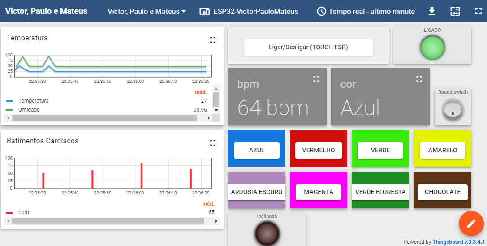
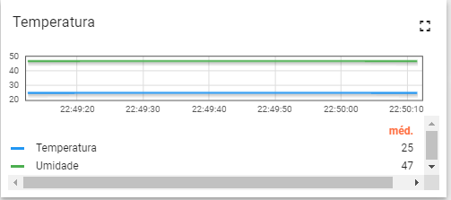
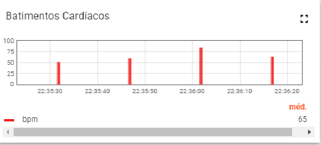
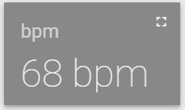
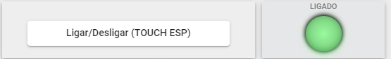
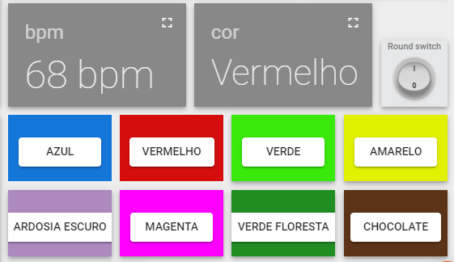

# Trabalho Final - FSE

UnB - Universidade de Brasilia  
FGA - Faculdade do Gama  
 
## Grupo:
|Aluno  |  Matricula |
| --------- | ------------------------------------------------------ |
|Paulo Vitor Abi CL | 190047968     | 
|Mateus Moreira Lima | 180024868      | 
|Victor Rayan Adriano Ferreira| 190044390 |

## Projeto

Pulseira de Auxílio "HelpBand" - Implementação de 6 Sensores para ESP32 IDF

A "HelpBand" é uma pulseira de auxílio desenvolvida como parte de um projeto de sistemas embarcados. A ideia por trás dessa pulseira é fornecer assistência e monitoramento a pessoas que necessitam de cuidados especiais, como idosos ou pessoas com necessidades médicas específicas. Além disso, ela te ajuda a automatizar tarefas como acender a Lâmpada e trocar a cor.

Através da integração de 6 diferentes sensores (KY-40, KY-39, touch, RGB, botão da ESP e DHT11) em uma placa ESP32 IDF, a pulseira "HelpBand" será capaz de coletar informações vitais, detectar situações de emergência e fornecer telemetria em tempo real para cuidadores ou profissionais de saúde, utilizando o dashboard do ThingsBoard para monitoramento e visualização dos dados.

## Sensores Utilizados

KY-40 (Encoder Rotativo): Mede a rotação de um eixo através de sinais pulsantes, permitindo determinar a direção e velocidade do movimento.

Touch (Sensor de Toque): Detecta toques ou interações táteis em uma superfície específica.

RGB (Sensor de Cores RGB): Emite luz nas cores vermelha, verde e azul, permitindo criar diversas tonalidades de cores.

Botão da ESP: Botão físico presente na placa ESP32, utilizado para interação do usuário com o sistema.

DHT11 (Sensor de Temperatura e Umidade): Mede a temperatura e umidade relativa do ar para monitoramento ambiental.

Sensor Cardíaco (KY-039): Mede o ritmo cardíaco de uma pessoa, geralmente através do pulso, fornecendo informações sobre a frequência cardíaca.

Sensor de Inclinação (Tilt Test Sensor): Detecta inclinação ou mudanças de posição em uma determinada direção, podendo ser utilizado para testes de inclinação e detecção de movimentos.

Pré-requisitos
Antes de buildar o projeto, certifique-se de ter instalado o ESP-IDF (Internet of Things Development Framework) em seu ambiente de desenvolvimento.

## Como Buildar o Projeto

1. Clone este repositório para o seu ambiente de desenvolvimento.

```bash 
git clone https://github.com/seu-usuario/nome-do-repositorio.git
```
2. Mude para a pasta do repositório.
```bash
cd nome-do-repositorio
```
3. Configure o projeto com as opções desejadas, se necessário.
```bash
idf.py menuconfig
```
4. Compile o projeto.
```bash
idf.py build
```
5. Flash o firmware na placa ESP32.
```bash
idf.py -p /dev/SEU_PORT_SERIAL flash
```
## Dashboard no ThingsBoard

Os dados coletados pelos sensores serão enviados para o ThingsBoard, uma plataforma de IoT de código aberto que permite criar dashboards para visualização de telemetria.

Acesse o ThingsBoard e crie uma conta ou faça login em uma conta existente.

Crie um novo dispositivo no ThingsBoard para a "HelpBand".

Anote o token de acesso do dispositivo criado.

No código-fonte do projeto, localize a parte responsável pelo envio dos dados para o ThingsBoard e insira o token de acesso do dispositivo criado.

<!-- Divirta-se e explore as possibilidades dos sistemas embarcados com a "HelpBand"! -->

### A aplicação


Essa é a tela de visualização principal do dashboard, ela contém as informações sobre a luz do quarto, e informações dos sensores em tempo real.

- Temperatura e Umidade

Na tela do dashboard temos os sensores de temperatura e umidade, que são atualizadas em tempo real através dos dados medidos do sensor `DHT11`.

- Batimentos cardíacos 

Na tela do dashboard temos também as informações do sensor de batimento cardíaco que é atualizado automaticamente através do sensor `KY-039` quando ele detecta o dedo no sensor.
<br></br>

<br></br>No dashboard também podemos ver a última leitura feita do sensor de batimentos cardiacos.

- Touch sensor 

O Dashboard também tem a função de ligar a esp ou através do `touch sensor` da esp mostrar o sinal de ligado no dashboard.

- Luz do quarto

A luz do quarto pode ser escolhida através do dashboard ou setada através do encoder `KY-040`, o switch tem a função de ligar ou desligar a luz.